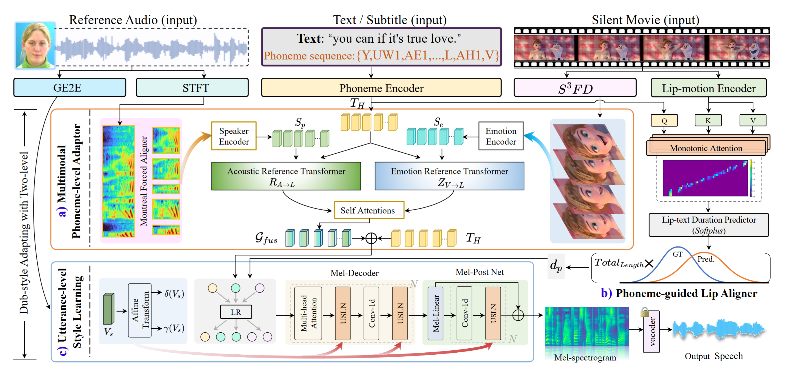

# StyleDubber Towards Multi-Scale Style Learning for Movie Dubbing

## Abstract
Given a script, the challenge in Movie Dubbing (Visual Voice Cloning, V2C) is to generate speech that aligns well with the video in both time and emotion, based on the tone of a reference audio track. Existing stateof-the-art V2C models break the phonemes in the script according to the divisions between video frames, which solves the temporal alignment problem but leads to incomplete phoneme pronunciation and poor identity stability. To address this problem, we propose StyleDubber, which switches dubbing learning from the frame level to phoneme level. It contains three main components: (1) A multimodal style adaptor operating at the phoneme level to learn pronunciation style from the reference audio, and generate intermediate representations informed by the facial emotion presented in the video; (2) An utterance-level style learning module, which guides both the mel-spectrogram decoding and the refining processes from the intermediate embeddings to improve the overall style expression; And (3) a phoneme-guided lip aligner to maintain lip sync. Extensive experiments on two of the primary benchmarks, V2C and Grid, demonstrate the favorable performance of the proposed method as compared to the current stateof-the-art. The code will be made available at [here](https://github.com/GalaxyCong/StyleDubber).

## Demos

[Result of Dubbing Setting1](#Setting1)

[Result of Dubbing Setting2](#Setting2)

[Result of Dubbing Setting3](#Setting3)

### The V2C Animation Setting1 Results

Text: "Yes, I'm the baby Jesus"
**(Please slide left or right)**

FastSpeech2 | StyleSpeech
------------|--------------
<video controls src="video_setting1/Fastspeech2.mp4" title="Title"></video>|<video controls src="video_setting1/Stylespeech.mp4" title="Title"></video>

Face-TTS | Zeroshot-TTS
------------|--------------
<video controls src="video_setting1/FaceTTS.mp4" title="Title"></video>|<video controls src="video_setting1/Zeroshot-TTS.mp4" title="Title"></video>

V2C-Net | HPMDubbing
------------|--------------
<video controls src="video_setting1/V2C-Net.mp4" title="Title"></video>|<video controls src="video_setting1/HPMDubbing.mp4" title="Title"></video>

Our StyleDubber | Ground Truth
------------|--------------
<video controls src="video_setting1/StyleDubber.mp4" title="Title"></video>|<video controls src="video_setting1/GT.mp4" title="Title"></video>

### The GRID Setting2 Results

Text: "place red with m eight now"
**(Please slide left or right)**

Reference

<video controls src="Setting2_Grid/Who_is_Reference_Audio/Grid_S10.mp4" title="Title"></video>

FastSpeech2 | StyleSpeech
------------|--------------
<video controls src="Setting2_Grid/FS2.mp4" title="Title"></video>|<video controls src="Setting2_Grid/StyleSpeech.mp4" title="Title"></video>

Face-TTS | Zeroshot-TTS
------------|--------------
<video controls src="Setting2_Grid/Face-TTS.mp4" title="Title"></video>|<video controls src="Setting2_Grid/Zero-shot-TTS.mp4" title="Title"></video>

V2C-Net | HPMDubbing
------------|--------------
<video controls src="Setting2_Grid/V2C-Net.mp4" title="Title"></video>|<video controls src="Setting2_Grid/HPMDubbing.mp4" title="Title"></video>

Our StyleDubber | Ground Truth
------------|--------------
<video controls src="Setting2_Grid/StyleDubber.mp4" title="Title"></video>|<video controls src="Setting2_Grid/GT.mp4" title="Title"></video>

### The V2C Animation Setting2 Results

Text: "You are not responsible for their choices, elsa."
**(Please slide left or right)**

Reference
<video controls src="Setting2_V2C/Who_is_Reference_Audio/Anna.mp4" title="Title"></video>

FastSpeech2 | StyleSpeech
------------|--------------
<video controls src="Setting2_V2C/FS2.mp4" title="Title"></video>|<video controls src="Setting2_V2C/StyleSpeech.mp4" title="Title"></video>

Face-TTS | Zeroshot-TTS
------------|--------------
<video controls src="Setting2_V2C/FaceTTS.mp4" title="Title"></video>|<video controls src="Setting2_V2C/Zero-shot-TTS.mp4" title="Title"></video>

V2C-Net | HPMDubbing
------------|--------------
<video controls src="Setting2_V2C/V2C_Net.mp4" title="Title"></video>|<video controls src="Setting2_V2C/HPMDubbing.mp4" title="Title"></video>

Our StyleDubber | Ground Truth
------------|--------------
<video controls src="Setting2_V2C/StyleDubber.mp4" title="Title"></video>|<video controls src="Setting2_V2C/GT.mp4" title="Title"></video>

### The V2C Animation Setting3 Results (Male voice actors dubbing female characters)

Text: "It's a lot of responsibility."
**(Please slide left or right)**

Raw Dubbing Video | Reference
------------|--------------
<video controls src="1——Setting3_V2C_1_male_to_female/Dubbing_Video_Raw/DragonII.mp4" title="Title"></video>|<video controls src="1——Setting3_V2C_1_male_to_female/Refenrece_audio/Grid-S27.mp4" title="Title"></video>

Face-TTS | Zeroshot-TTS
------------|--------------
<video controls src="1——Setting3_V2C_1_male_to_female/Face-TTS.mp4" title="Title"></video>|<video controls src="1——Setting3_V2C_1_male_to_female/Zero-shot-TTS.mp4" title="Title"></video>

V2C-Net | FastSpeech2
------------|--------------
<video controls src="1——Setting3_V2C_1_male_to_female/V2C-Net.mp4" title="Title"></video>|<video controls src="1——Setting3_V2C_1_male_to_female/FS2.mp4" title="Title"></video>

Our StyleDubber | HPMDubbing
------------|--------------
<video controls src="1——Setting3_V2C_1_male_to_female/StyleDubber.mp4" title="Title"></video>|<video controls src="1——Setting3_V2C_1_male_to_female/HPMDUbbing.mp4" title="Title"></video>

### The V2C Animation Setting3 Results (Male voice actors dubbing male characters)

Text: "I can't help. I can't help anyone."
**(Please slide left or right)**

Raw Dubbing Video | Reference
------------|--------------
<video controls src="2——Setting3_V2C_1_male_to_male/Dubbing_Video_Raw/Toy@Buzz.mp4" title="Title"></video>|<video controls src="2——Setting3_V2C_1_male_to_male/Refenrece_audio/Grid_S32.mp4" title="Title"></video>

Face-TTS | Zeroshot-TTS
------------|--------------
<video controls src="2——Setting3_V2C_1_male_to_male/Face-TTS.mp4" title="Title"></video>|<video controls src="2——Setting3_V2C_1_male_to_male/Zero-shot-TTS.mp4" title="Title"></video>

V2C-Net | FastSpeech2
------------|--------------
<video controls src="2——Setting3_V2C_1_male_to_male/V2C_Net.mp4" title="Title"></video>|<video controls src="2——Setting3_V2C_1_male_to_male/FS2.mp4" title="Title"></video>

Our StyleDubber | HPMDubbing
------------|--------------
<video controls src="2——Setting3_V2C_1_male_to_male/StyleDubber.mp4" title="Title"></video>| <video controls src="2——Setting3_V2C_1_male_to_male/HPMDubbing.mp4" title="Title"></video>

### The V2C Animation Setting3 Results (Female voice actors dubbing male characters)

Text: "I thought you would understand."
**(Please slide left or right)**

Raw Dubbing Video | Reference
------------|--------------
<video controls src="3——Setting3_V2C_1_female_to_male/Dubbing_Video_Raw/Cloudy@Earl.mp4" title="Title"></video>|<video controls src="3——Setting3_V2C_1_female_to_male/Refenrece_audio/S16.mp4" title="Title"></video>

Face-TTS | Zeroshot-TTS
------------|--------------
<video controls src="3——Setting3_V2C_1_female_to_male/Face-TTS.mp4" title="Title"></video>|<video controls src="3——Setting3_V2C_1_female_to_male/Zero-shot-TTS.mp4" title="Title"></video>

V2C-Net | FastSpeech2
------------|--------------
<video controls src="3——Setting3_V2C_1_female_to_male/V2C_Net.mp4" title="Title"></video>|<video controls src="3——Setting3_V2C_1_female_to_male/FS2.mp4" title="Title"></video>

Our StyleDubber | HPMDubbing 
------------|--------------
<video controls src="3——Setting3_V2C_1_female_to_male/StyleDubber.mp4" title="Title"></video>| <video controls src="3——Setting3_V2C_1_female_to_male/HPMDubbing.mp4" title="Title"></video>
